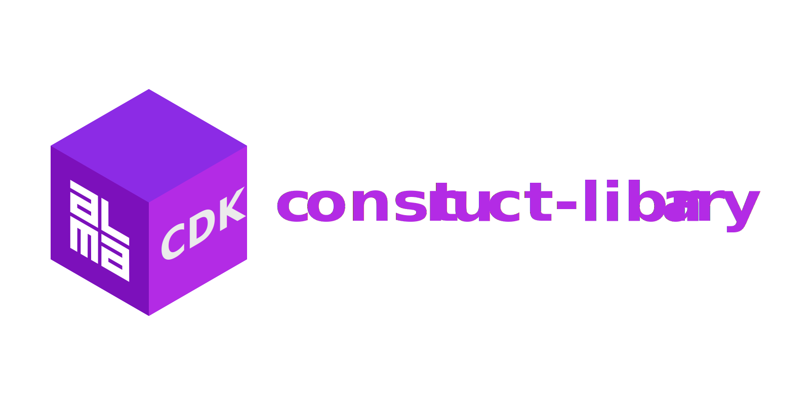

<div align="center">
  <h1>
	
  <br/>
  <br/>
  </h1>

  
  
  [](https://github.com/alma-cdk/construct-library/actions/workflows/release.yml)
  [](https://sonarcloud.io/summary/new_code?id=alma-cdk_construct-library)
  [](https://sonarcloud.io/summary/new_code?id=alma-cdk_construct-library)
  <hr/>
</div>

Custom [Projen Project Type](https://projen.io/docs/concepts/projects/building-your-own/) to manage all the `alma-cdk/*` CDK construts.

## Installation

1. Install with `npm`:
    ```sh
    npm i -D @alma-cdk/construct-library
    ```

2. If existing project, install `npm i -D projen@0.99.21` or newer

2. Import the custom Projen project type:
    ```diff
    - import { AwsCdkConstructLibrary } from 'projen/lib/awscdk';
    + import { cdk } from "projen";
    + import { AlmaCdkConstructLibrary } from "@alma-cdk/construct-library";
    ```

3. Initialize and define (at least) minimum required configuration:
    ```ts
    const project = new AlmaCdkConstructLibrary({
      name: "@<SCOPE>/<PACKAGE_NAME>", // or "<PACKAGE_NAME>"
      author: "<AUTHOR_ORGANIZATION_NAME>",
      authorAddress: "<AUTHOR_ORGANIZATION_EMAIL>",
      description: "<PACKAGE_DESCRIPTION>",
      repositoryUrl: "https://<GIT_URL>.git",
      stability: cdk.Stability.EXPERIMENTAL, // or STABLE or DEPRECATED
      majorVersion: 0, // 1, 2, ...
      releaseEnvironment: "production",
    });

    project.synth();
    ```


4. Fnm use 24 

4. Install `pnpm`

5. Run `projen` with `pnpm`:
    ```sh
    pnpm exec projen
    ```

6. Ensure correct Node version: `fnm use`

7. Remove old `node_modules`, `yarn.lock`, and/or `package-lock.json` files

8. Reinstall everything with `pnpm install`

